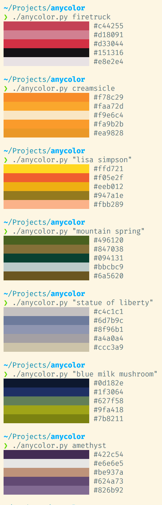

# anycolor

Terminal-based search engine for color



## Usage

Requires Python3, [Google Cloud Vision](https://googleapis.dev/python/vision/latest/index.html) access, and a [Programmable Search Engine](https://programmablesearchengine.google.com/about/), configured to use image search.

Set up [authentication for the Google API](https://googleapis.dev/python/google-api-core/latest/auth.html), and set the `GOOGLE_CUSTOM_SEARCH_ENGINE_ID` and `GOOGLE_CUSTOM_SEARCH_ENGINE_KEY` environment variables.

``` sh
pip install -r requirements.txt
python anycolor.py "kind of blue" 
```

